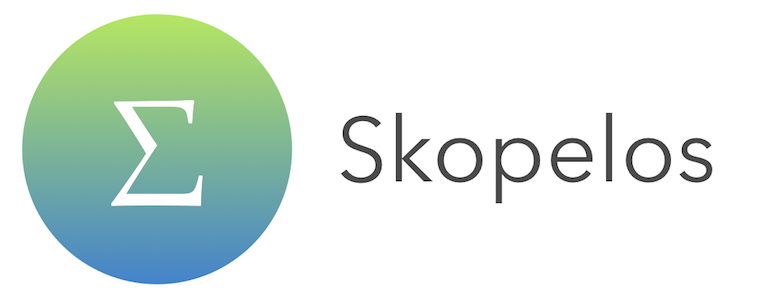

# Skopelos



[](https://www.bitrise.io/app/e4a0c4deb80d6fe2)

A minimalistic, thread-safe, non-boilerplate and super easy to use version of Active Record on Core Data.
Simply all you need for doing Core Data. Swift 3.0 flavour.

[Objective-C version](https://github.com/albertodebortoli/Skiathos)

## General notes

This component aims to have an extremely easy interface to introduce Core Data into your app with almost zero effort.

The design introduced here involves a few main components:

- CoreDataStack
- AppStateReactor
- DALService (Data Access Layer)

### CoreDataStack

If you have experience with Core Data, you might know that creating a stack is an annoying process full of pitfalls.
This component is responsible for the creation of the stack (in terms of chain of managed object contexts) using the design described [here](http://martiancraft.com/blog/2015/03/core-data-stack/) by Marcus Zarra.

```
      Managed Object Model <------ Persistent Store Coordinator ------> Persistent Store
                                                ^
                                                |
                           Root Context (NSPrivateQueueConcurrencyType)
                                                ^
                                                |
              ------------> Main Context (NSMainQueueConcurrencyType) <-------------
              |                                 ^                                  |
              |                                 |                                  |
        Child Context                     Child Context                      Child Context
(NSPrivateQueueConcurrencyType)   (NSPrivateQueueConcurrencyType)    (NSPrivateQueueConcurrencyType)
```

An important difference from Magical Record, or other third-party libraries, is that the savings always go in one direction, from children down (or up?) to the persistent store.
Other components allow you to create children that have the private context as parent and this causes the main context not to be updated or to be updated via notifications to merge the context.
The main context should be the source of truth and it is tied the UI: having a much simpler approach helps to create a system easier to reason about.

### AppStateReactor

You should ignore this one. It sits in the CoreDataStack and takes care of saving the in-flight changes back to disk if the app goes to background, loses focus or is about to be terminated. It's a silent friend who takes care of us.


### DALService (Data Access Layer) / Skopelos

If you have experience with Core Data, you might also know that most of the operations are repetitive and that we usually call `performBlock`/`performBlockAndWait` on a context providing a block that eventually will call `save:` on that context as last statement.
Databases are all about readings and writings and for this reason our APIs are in the form of `read(statements: NSManagedObjectContext -> Void)` and `writeSync(changes: NSManagedObjectContext -> Void)`/`writeAsync(changes: NSManagedObjectContext -> Void)`: 2 protocols providing a CQRS (Command and Query Responsibility Segregation) approach.
Read blocks will be executed on the main context (as it's considered to be the single source of truth). Write blocks are executed on a child context which is saved at the end; changes are eventually saved asynchronously back to the persistent store without blocking the main thread. 
The completion handler of the write methods calls the completion handler when the changes are saved back to the persistent store.

In other words, writings are always consistent in the main managed object context and eventual consistent in the persistent store.
Data are always available in the main managed object context.

`Skopelos` is just a subclass of `DALService`, to give a nice name to the component. 


## How to use

Import `Skopelos`.

To use this component, you could create a property of type `Skopelos` and instantiate it like so:

```swift
self.skopelos = SkopelosClient(sqliteStack: "<#ModelURL>")
```
or
```swift
self.skopelos = SkopelosClient(sqliteStack: "<#ModelURL>", securityApplicationGroupIdentifier: "<#GroupID>")

```
or
```swift
self.skopelos = Skopelos(inMemoryStack: "<#ModelURL>")
```

You could then pass around the skopelos in other parts of the app via dependency injection.
It has to be said that it's perfectly acceptable to use a singleton for the Core Data stack. Also, allocating instances over and over is expensive. Generally speaking, we don't like singletons. They are not testable by nature, clients don't have control over the lifecycle of the object and they break some principles. For these reasons, the library comes free of singletons.

There are 2 reasons why you should inherit from `Skopelos`:

- to create a shared instance for global access
- to override `override func handleError(error: NSError)` to perform specific actions when an error is encountered and this method is called 

To create a singleton, you should inherit from Skopelos like so:

### Singleton

```swift
class SkopelosClient: Skopelos {

    static let shared: Skopelos = {

        var skopelos: Skopelos!

        if let modelURL = Bundle(for: Skopelos.self).url(forResource: "<#DataModel>", withExtension: "momd") {
            skopelos = Skopelos(inMemoryStack: modelURL)
        }

        return skopelos

    }()
    
    override func handle(error: Error) {
        // clients should do the right thing here
        print(error.localizedDescription)
    }
}
```

### Readings and writings

Speaking of readings and writings, let's do now a comparison between some standard Core Data code and code written with Skopelos.

Standard Core Data reading:

```objc
__block NSArray *results = nil;

NSManagedObjectContext *context = ...;
[context performBlockAndWait:^{

    NSFetchRequest *request = [[NSFetchRequest alloc] init];
    NSEntityDescription *entityDescription = [NSEntityDescription entityForName:NSStringFromClass(User)
    inManagedObjectContext:context];
    [request setEntity:entityDescription];

    NSError *error;
    results = [context executeFetchRequest:request error:&error];
}];

return results;
```

Standard Core Data writing:

```objc
NSManagedObjectContext *context = ...;
[context performBlockAndWait:^{

    User *user = [NSEntityDescription insertNewObjectForEntityForName:NSStringFromClass(User)
    inManagedObjectContext:context];
    user.firstname = @"John";
    user.lastname = @"Doe";

    NSError *error;
    [context save:&error];
    if (!error)
    {
        // continue to save back to the store
    }
}];

```

Skopelos reading: 

```swift
SkopelosClient.shared.read { context in
    let users = User.SK_all(context)
    print(users)
}
```

Skopelos writing:

```swift
// Sync
SkopelosClient.shared.writeSync { context in
    let user = User.SK_create(context)
    user.firstname = "John"
    user.lastname = "Doe"
}

SkopelosClient.shared.writeSync({ context in
    let user = User.SK_create(context)
    user.firstname = "John"
    user.lastname = "Doe"
    }, completion: { (error: NSError?) in
        // changes are saved to the persistent store
})

// Async
SkopelosClient.shared.writeAsync { context in
    let user = User.SK_create(context)
    user.firstname = "John"
    user.lastname = "Doe"
}

SkopelosClient.shared.writeAsync({ context in
    let user = User.SK_create(context)
    user.firstname = "John"
    user.lastname = "Doe"
}, completion: { (error: NSError?) in
    // changes are saved to the persistent store
})
```

Skopelos also supports chaining:

```swift
SkopelosClient.shared.writeSync { context in
    user = User.SK_create(context)
    user.firstname = "John"
    user.lastname = "Doe"
}.writeSync { context in
    if let userInContext = user.SK_inContext(context) {
        userInContext.SK_remove(context)
    }
}.read { context in
    let users = User.SK_all(context)
    print(users)
}
```

The `NSManagedObject` category provides CRUD methods always explicit on the context. The context passed as parameter should be the one received in the read or write block. You should always use these methods from within read/write blocks. Main methods are:

```swift
static func SK_create(context: NSManagedObjectContext) -> Self
static func SK_numberOfEntities(context: NSManagedObjectContext) -> Int
func SK_remove(context: NSManagedObjectContext) -> Void
static func SK_removeAll(context: NSManagedObjectContext) -> Void
static func SK_all(context: NSManagedObjectContext) -> [Self]
static func SK_all(predicate: NSPredicate, context:NSManagedObjectContext) -> [Self]
static func SK_first(context: NSManagedObjectContext) -> Self?
```

Mind the usage of `SK_inContext:` to retrieve an object in different read/write blocks (same read blocks are safe).


## Thread-safety notes

All the accesses to the persistence layer done via a `DALService` instance are guaranteed to be thread-safe.

It is highly suggested to enable the flag `-com.apple.CoreData.ConcurrencyDebug 1` in your project to make sure that you don't misuse Core Data in terms of threading and concurrency (by accessing managed objects from different threads and similar errors).

This component doesn't aim to introduce interfaces with the goal of hiding the concept of `ManagedObjectContext`: it would open up the doors to threading issues in clients' code as developers should be responsible to check for the type of the calling thread at some level (that would be ignoring the benefits that Core Data gives to us).
Therefore, our design forces to make all the readings and writings via the `DALService` and the `ManagedObject` category methods are intended to always be explicit on the context (e.g. `SK_create`).
